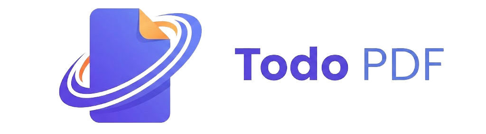

# 📄 TodoPDF Library - Gestor de PDFs Inteligente

<div align="center">
  
  <br />
  <p><b>Desarrollado por TorreTek Innovation</b></p>
  
  [](https://hub.docker.com/r/torretekinnovation/todo-pdf)
  [](https://github.com/torretek-Innovation/TodoPdf-Librery)
  [](https://nextjs.org/)
  [](https://www.prisma.io/)
</div>

---

## 🚀 Acerca del Proyecto

**TodoPDF Library** es una solución profesional diseñada para la organización, visualización y gestión eficiente de documentos PDF. A diferencia de las plataformas tradicionales en la nube, TodoPDF se centra en la **privacidad y el control total**, permitiéndote hospedar tu propia biblioteca en tu infraestructura local o servidor privado.

### ✨ Funcionalidades Principales

- 📁 **Organización Inteligente:** Categoriza tus documentos mediante carpetas y etiquetas personalizadas.
- 🖼️ **Vistas Previas Automáticas:** Generación instantánea de portadas para todos tus archivos.
- 🔍 **Búsqueda Avanzada:** Encuentra cualquier documento por título, autor o metadatos.
- 🔐 **Seguridad Integrada:** Sistema de autenticación robusto con JWT para proteger tu información.
- 📱 **Multi-plataforma:** Disponible como aplicación de escritorio (Electron) o servicio auto-hospedado (Docker).

---

## 🛠️ Métodos de Despliegue

### 1. Despliegue con Docker (Recomendado)

Este es el método más rápido y sencillo para poner en marcha el sistema en un servidor (NAS, VPS, etc.).

#### Requisitos
- [Docker](https://www.docker.com/) instalado.
- [Docker Compose](https://docs.docker.com/compose/) instalado.

#### Instrucciones
1. Crea una carpeta para el proyecto:
   ```bash
   mkdir todo-pdf && cd todo-pdf
   ```

2. Crea un archivo llamado `docker-compose.yml` y pega el siguiente contenido:

```yaml
services:
  app:
    image: torretekinnovation/todo-pdf:latest
    container_name: todo-pdf-app
    restart: always
    ports:
      - "3000:3000"
    environment:
      - DATABASE_URL=file:/app/prisma/dev.db
      - JWT_SECRET=tu_clave_secreta_super_segura_cambiala_en_produccion
      - PORT=3000
    volumes:
      - todo-pdf-data:/app/prisma
      - todo-pdf-public:/app/public

volumes:
  todo-pdf-data:
  todo-pdf-public:
```

3. Levanta el servicio:
   ```bash
   docker compose up -d
   ```

Tu aplicación estará disponible en `http://localhost:3000`.

---

### 2. Desarrollo Local (npm)

Si deseas modificar el código o correrlo directamente en tu máquina de desarrollo.

#### Requisitos
- Node.js 20+ 
- npm o yarn

#### Instrucciones
1. Clona el repositorio:
   ```bash
   git clone https://github.com/torretek-Innovation/TodoPdf-Librery.git
   cd TodoPdf-Librery
   ```

2. Instala las dependencias:
   ```bash
   npm install
   ```

3. Configura las variables de entorno:
   Crea un archivo `.env` en la raíz con:
   ```env
   DATABASE_URL="file:./dev.db"
   JWT_SECRET="tu_clave_secreta"
   ```

4. Genera el cliente de base de datos (Prisma):
   ```bash
   npx prisma generate
   ```

5. Inicia el servidor de desarrollo:
   ```bash
   npm run dev
   ```

Abra [http://localhost:3000](http://localhost:3000) en su navegador.

---

## ⚙️ Variables de Entorno

| Variable | Descripción | Valor por Defecto |
| :--- | :--- | :--- |
| `DATABASE_URL` | Ruta a la base de datos SQLite | `file:./dev.db` |
| `JWT_SECRET` | Clave para firmar tokens de acceso | *Requerido* |
| `PORT` | Puerto en el que corre la aplicación | `3000` |

---

## 🏗️ Stack Tecnológico

- **Frontend:** Next.js 15 (App Router), React 19, Tailwind CSS.
- **Backend:** Next.js API Routes.
- **Base de Datos:** SQLite con Prisma ORM.
- **Contenedores:** Docker & Docker Compose.
- **Escritorio:** Electron.

---

## 🤝 Contribuciones y Soporte

¿Te interesa mejorar TodoPDF? ¡Las contribuciones son bienvenidas!
- Reporta errores en la sección de [Issues](https://github.com/torretek-Innovation/TodoPdf-Librery/issues).
- Envía tus sugerencias mediante Pull Requests.

Desarrollado con ❤️ por [TorreTek Innovation](https://github.com/torretek-Innovation).

---
© 2026 TodoPDF Library v1.0.0.
